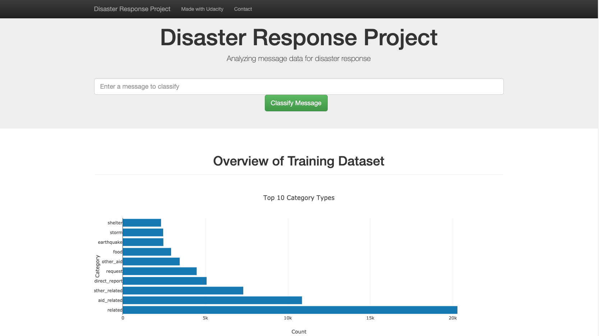

# Disaster Response Pipeline Project
Analyze disaster data from Figure Eight to build a model for an API that classifies disaster messages. This project was made as part of Udacity Data Science Nanodegree.

## Installation
There should be no necessary libraries to run the code here beyond the Anaconda distribution of Python (mostly scikit-learn and nltk). The code should run with no issues using Python versions 3.*.

## Data
Data comes from Figure Eight in CSV format and can be found in [workspace data directory](webapp/workspace/data). The files contain real messages that were sent during disaster events.

## Project Overview
The project creates a machine learning pipeline to classify existing messages so that new messages will automatically be sent to an appropriate disaster relief agency.

The project includes a web app where an emergency worker can input a new message and get classification results in several categories. The web app will also displays visualizations of the data. 

Below are a few screenshots of the web made available by the project.

## Instructions for running the project:
1. Run the following commands in the [project's root directory](./webapp/workspace) to set up a new database and model.

    - To run ETL pipeline that cleans data and stores in database
        `python data/process_data.py data/disaster_messages.csv data/disaster_categories.csv data/DisasterResponse.db`
    - To run ML pipeline that trains classifier and saves
        `python models/train_classifier.py data/DisasterResponse.db models/classifier.pkl` (a trained model is already available).

2. Run the following command in the app's directory to run your web app.
    `python run.py`

3. Go to http://0.0.0.0:3001/

## Licensing, Authors, Acknowledgements
Must give credit to [Udacity](https://www.udacity.com/course/data-scientist-nanodegree--nd025) and [Figure Eight](https://www.figure-eight.com/) for the project template and data. You can find the Licensing for the data and other descriptive information at the respective websites. Otherwise, feel free to use the code here as you would like!
